# FiUnamFS - Administrador de Sistema de Archivos

## Descripción

Este proyecto consiste en el desarrollo de un administrador básico para el sistema de archivos FiUnamFS utilizando Python. El programa permite interactuar directamente con una imagen de disco (`fiunamfs.img`) implementando operaciones fundamentales de un sistema de archivos.

El proyecto fue desarrollado trabajando directamente con estructuras binarias, offsets, clusters y entradas de directorio, además de implementar concurrencia mediante multihilos.

---

# Características

| Operación                                  | Estado |
| ------------------------------------------ | ------ |
| Listar archivos                            | ✅      |
| Copiar archivos desde FiUnamFS hacia la PC | ✅      |
| Copiar archivos desde la PC hacia FiUnamFS | ✅      |
| Eliminar archivos                          | ✅      |
| Manejo de directorio                       | ✅      |
| Escritura binaria sobre la imagen          | ✅      |
| Concurrencia con multihilos                | ✅      |
| Logger asíncrono                           | ✅      |

---

# Estructura del proyecto

```text
Proyecto/
│
├── main.py
├── fiunamfs.py
├── threads.py
├── fiunamfs.img
└── capturas/
    ├── captura1.png
    ├── captura2.png
    ├── captura3.png
    └── ...
```

---

# Información de FiUnamFS

El sistema de archivos FiUnamFS trabaja utilizando clusters de tamaño fijo.

| Elemento                        | Tamaño      |
| ------------------------------- | ----------- |
| Tamaño del cluster              | 2048 bytes  |
| Tamaño de entrada de directorio | 64 bytes    |
| Entradas máximas                | 256         |
| Cluster 0                       | Superbloque |
| Clusters 1-8                    | Directorio  |
| Cluster 9 en adelante           | Datos       |

---

# Desarrollo del proyecto


## Lectura inicial del sistema de archivos

Primero se realizó una prueba sencilla para verificar que el archivo `fiunamfs.img` pudiera abrirse correctamente en modo binario y así comprobar la lectura del superbloque.

```python
with open("fiunamfs.img", "rb") as disco:
    disco.seek(5)
    nombre = disco.read(8).decode("ascii")
    print(nombre)
```

La salida obtenida fue:

<div align="left">
  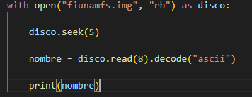
</div>

Con esto se confirmó que el sistema de archivos podía leerse correctamente. Posteriormente se hizo una lectura de los archivos del disco

<div align="left">
  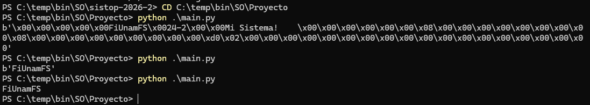
</div>

## Listado de archivos

Posteriormente se implementó la lectura del directorio recorriendo las 256 entradas posibles dentro de FiUnamFS.

Cada entrada fue interpretada leyendo:

* Tipo de entrada
* Nombre del archivo
* Tamaño
* Cluster inicial

Para ello se utilizaron offsets calculados manualmente y la librería `struct` para interpretar enteros en formato little-endian.

```python
offset = DIRECTORIO_OFFSET + (i * ENTRADA_SIZE)
```

```python
tamaño = struct.unpack("<I", entrada[16:20])[0]
```

<div align="left">
  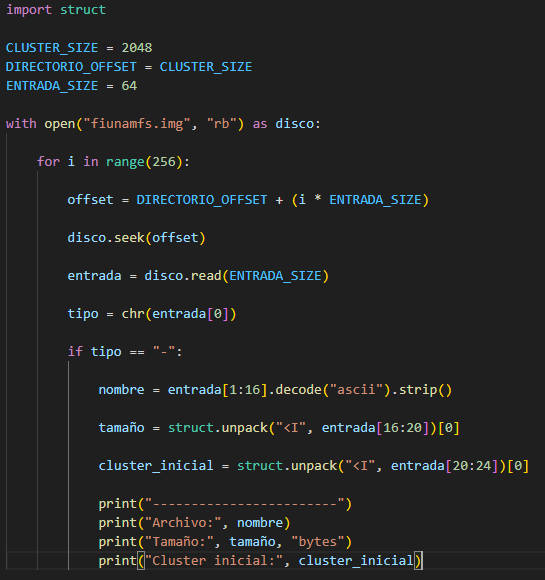
</div>

Resultado obtenido:

<div align="left">
  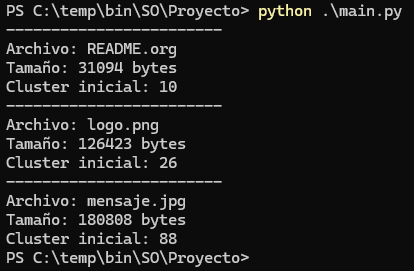
</div>

---

## Copiar archivos desde FiUnamFS hacia la PC

Después se desarrolló la funcionalidad para copiar archivos desde el sistema FiUnamFS hacia la computadora.

Para esto fue necesario:

1. Buscar el archivo dentro del directorio
2. Obtener el cluster inicial
3. Calcular el offset real dentro del disco
4. Leer los bytes binarios
5. Reconstruir el archivo en la PC

Durante las pruebas se detectó un problema con los nombres de archivo, ya que internamente los nombres estaban almacenados con bytes nulos:

```text
logo.png\x00\x00\x00...
```

Esto provocaba que las comparaciones de nombres fallaran.

La solución fue limpiar los bytes basura utilizando:

```python
nombre = entrada[1:16].decode("ascii").replace('\x00', '').strip()
```

<div align="left">
  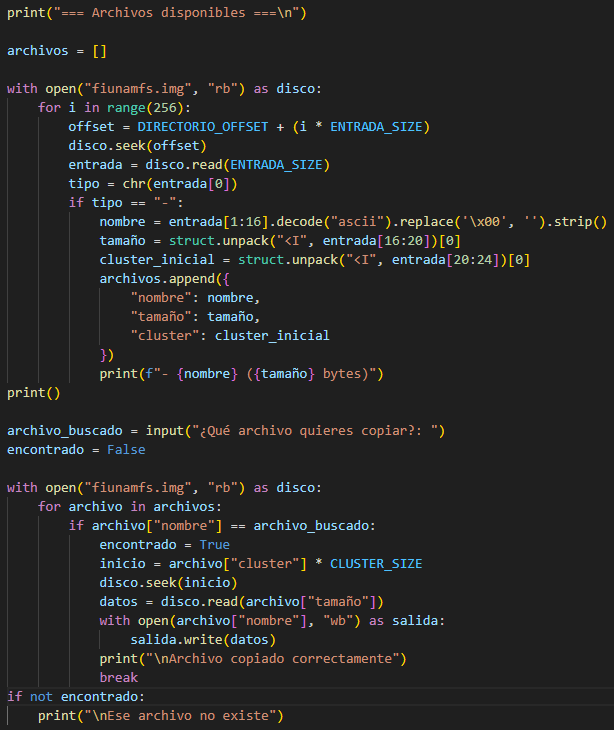
</div>

Posteriormente se agregó una lista automática de archivos disponibles para que el usuario pudiera seleccionar qué archivo copiar.

<div align="left">
  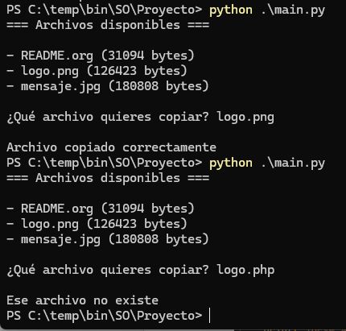
</div>

---

## Modularización del proyecto

Una vez que las operaciones básicas funcionaban correctamente, el proyecto fue dividido en varios archivos `.py` para mejorar la organización y hacer el código más mantenible.

* `main.py` contiene el menú principal
* `fiunamfs.py` contiene la lógica del sistema de archivos
* `threads.py` contiene la lógica de concurrencia y logger

El menú principal quedó encargado únicamente de la interacción con el usuario.

---

## Eliminación de archivos

Para eliminar archivos se modificó la entrada correspondiente en el directorio cambiando el byte de estado:

```text
- → archivo válido
/ → entrada libre
```

La eliminación no borra físicamente los datos del disco, únicamente libera la entrada del directorio.

```python
disco.seek(archivo["offset"])
disco.write(b'/')
```

<div align="left">
  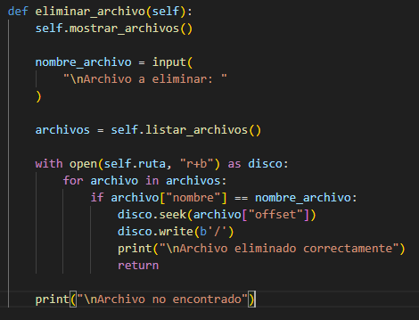
</div>

---

## Copiar archivos desde la PC hacia FiUnamFS

Posteriormente se desarrolló la funcionalidad para copiar archivos desde la computadora hacia FiUnamFS.

Para lograr esto fue necesario:

1. Buscar una entrada libre dentro del directorio
2. Encontrar espacio libre en la zona de datos
3. Escribir los datos binarios del archivo
4. Crear una nueva entrada de directorio

### Búsqueda de entradas libres

```python
if tipo == "/":
    return offset
```

<div align="left">
  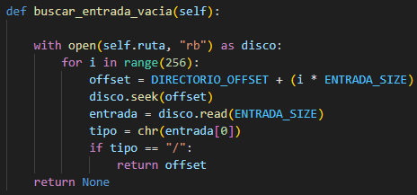
</div>

### Búsqueda de clusters libres

Se recorrieron los archivos existentes calculando cuántos clusters ocupaba cada uno.

```python
clusters_ocupados = (
    archivo["tamaño"] + CLUSTER_SIZE - 1
) // CLUSTER_SIZE
```

<div align="left">
  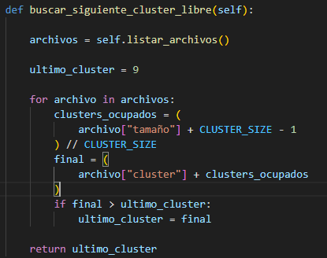
</div>

---

## Restricción de nombres

Durante las pruebas se detectó otro problema: FiUnamFS únicamente permite nombres de máximo 15 bytes.

Por ello se agregó una validación:

```python
if len(nombre_archivo) > 15:
    print("\nNombre demasiado largo")
    return
```

Además se implementó un listado automático de archivos disponibles en la carpeta del proyecto para facilitar las pruebas.

<div align="left">
  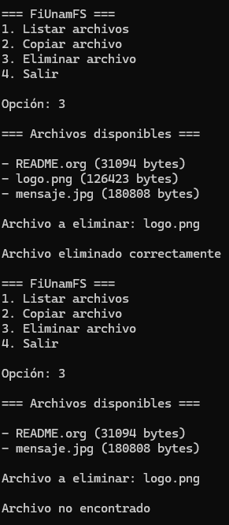
</div>

---

## Pruebas de funcionamiento

Finalmente se comprobó:

* Copia correcta hacia FiUnamFS
* Listado correcto
* Extracción correcta
* Eliminación correcta

<div align="left">
  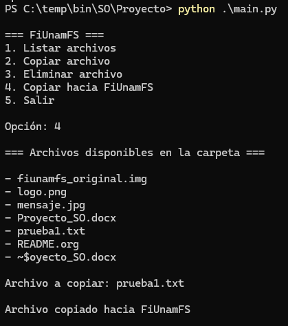
</div>
<div align="left">
  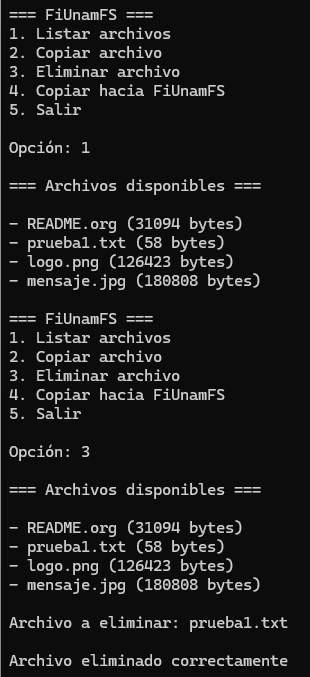
</div>

---

# Concurrencia y multihilos

Una vez finalizado el sistema principal, se agregó concurrencia utilizando multihilos.

Se implementó:

* Un hilo principal encargado del menú
* Un hilo secundario logger encargado de registrar operaciones

Para ello se utilizó:

* `Thread`
* `Queue`

```python
from threading import Thread
from queue import Queue
```

<div align="left">
  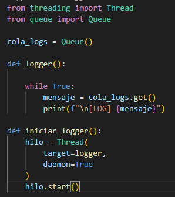
</div>

El logger se inicializa desde `main.py`:

```python
iniciar_logger()
```

<div align="left">
  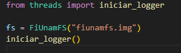
</div>

Posteriormente se agregaron registros automáticos después de cada operación importante.

```python
cola_logs.put(
    f"Archivo eliminado: {nombre_archivo}"
)
```

<div align="left">
  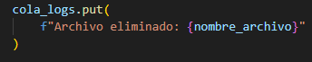
</div>

---

## Evidencia de concurrencia

Durante las pruebas se observó que el logger imprimía mensajes mientras el menú seguía ejecutándose.

Esto provocaba que algunos mensajes aparecieran entre los prints del menú, demostrando que ambos hilos estaban ejecutándose de forma asíncrona.

<div align="left">
  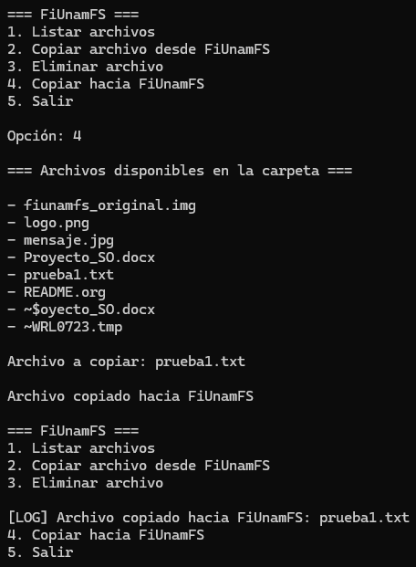
</div>

Posteriormente se modificó el formato del logger para mejorar la visualización:

```python
print(f"\n>>> [LOG] {mensaje}\n")
```

<div align="left">
  
</div>

Aunque esto mejora visualmente la consola, no elimina el hecho de que los hilos sigan ejecutándose concurrentemente.

---

# Cómo ejecutar

Ubicarse en la carpeta del proyecto:

```bash
cd Proyecto
```

Ejecutar:

```bash
python main.py
```

---

# Tecnologías utilizadas

* Python 3
* threading
* queue
* struct
* os

---

# Conclusiones

Durante el desarrollo del proyecto se logró comprender el funcionamiento básico de un sistema de archivos trabajando directamente con estructuras binarias.

Se implementaron operaciones fundamentales como:

* lectura de directorio
* manejo de offsets
* administración de clusters
* escritura binaria
* copia de archivos
* eliminación de archivos

Además se implementó concurrencia mediante multihilos utilizando `Thread` y `Queue`, permitiendo registrar operaciones de manera asíncrona mediante un logger independiente.

El proyecto permitió entender de manera práctica conceptos importantes relacionados con sistemas operativos y sistemas de archivos.
